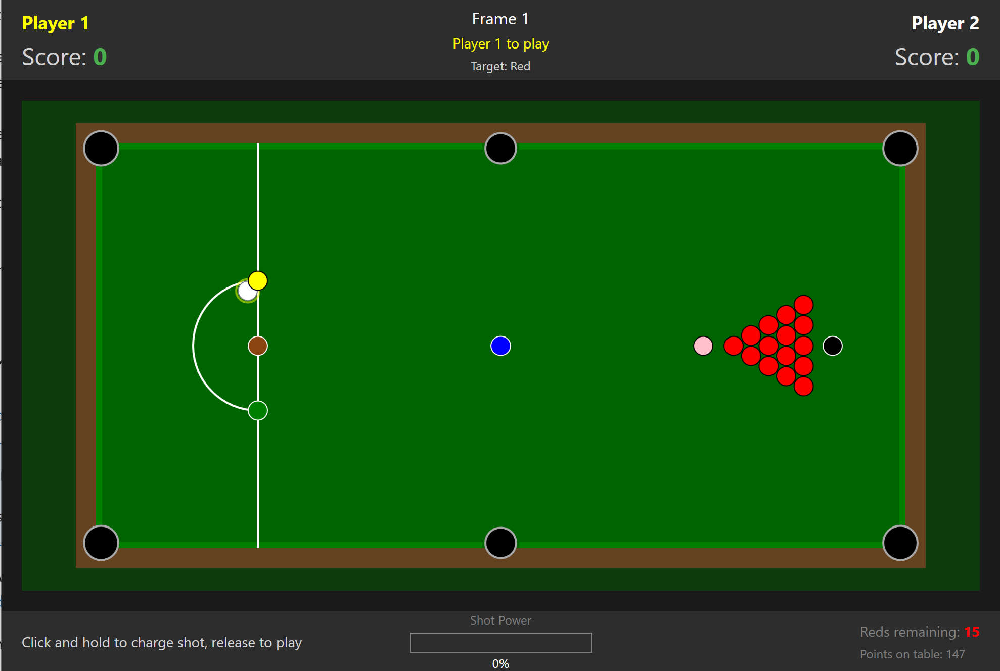

# Snooker Game - Physics Simulation Exemplar for A-Level NEA Projects

## Overview

This exemplar WPF application demonstrates a two-player snooker game with realistic physics simulation. It showcases fundamental programming concepts required for AQA 7517 A-Level Computer Science NEA projects, including object-oriented programming, complex mathematical models, and game loop architecture.



---

> **Note on Authorship**: This entire project, including all code, documentation, and this README, was generated by Claude AI  initially with documentation using Github Copilot. It was created as an educational resource for A-Level Computer Science teachers and students. It is intended to demonstrate programming concepts and techniques, **not** to serve as a template for student NEA projects.

## ⚠️ Important Notice for Students

**This project must NOT be submitted as your own work OR copied from for your AQA 7517 NEA coursework.**

This exemplar is designed to help you:
- Understand how complex game projects are structured
- Learn physics simulation techniques
- See how OOP principles are applied in practice
- Recognise patterns you might use in your own original project

Your NEA must be **your own original work**, addressing a problem **you have identified** and designed **yourself**.

---

## Project Structure

```
SnookerGame/
├── Models/
│   ├── Vector2D.cs        - 2D vector mathematics class
│   ├── Ball.cs            - Abstract base class for all balls
│   ├── CueBall.cs         - Player-controlled white ball
│   ├── ColouredBall.cs    - Red and coloured balls (21 total)
│   ├── Table.cs           - Snooker table with pockets and cushions
│   ├── Pocket.cs          - Pocket detection and positioning
│   └── Player.cs          - Player scoring and statistics
├── Engine/
│   ├── PhysicsEngine.cs   - Physics simulation (movement, collisions, friction)
│   └── GameManager.cs     - Game rules, turns, and state management
├── Views/
│   ├── MainWindow.xaml    - User interface layout (XAML markup)
│   └── MainWindow.xaml.cs - Code-behind (input handling, rendering)
└── README.md              - This documentation file
```

---

## Understanding AQA 7517 Technical Skills

This exemplar demonstrates specific skills from the AQA specification (Section 4.14.3.4.1) that are commonly needed in game and simulation projects.

### Group A Skills Demonstrated

| Skill | Where Demonstrated | Explanation |
|-------|-------------------|-------------|
| **Complex user-defined OOP** | `Ball.cs`, `CueBall.cs`, `ColouredBall.cs` | Inheritance hierarchy with abstract base class, virtual methods, and polymorphism |
| **Complex mathematical model** | `Vector2D.cs`, `PhysicsEngine.cs` | Trigonometry for aiming, elastic collision equations, vector mathematics |
| **Recursive/complex algorithms** | `PhysicsEngine.CheckBallCollisions()` | Iterative collision resolution handling chain reactions |
| **Complex data structures** | `GameManager.cs`, `Table.cs` | Collections managing game objects, state machines |

### Group B Skills Demonstrated

| Skill | Where Demonstrated | Explanation |
|-------|-------------------|-------------|
| **Simple user-defined OOP** | `Player.cs`, `Pocket.cs` | Encapsulated classes with properties and methods |
| **User-defined methods** | Throughout all classes | Parameterised methods with return values |
| **Selection statements** | `GameManager.CheckForFouls()` | Complex conditional logic for rule enforcement |
| **Iteration** | `PhysicsEngine.Update()` | Loops processing all balls each frame |
| **Data validation** | `Table.IsInD()`, `CueBall.PlaceBall()` | Validating ball placement positions |
| **String handling** | `Player.GetStatusString()` | Formatting score displays |

---

## Design Rationale

### Why Object-Oriented Programming?

The snooker game naturally maps to objects:

1. **Balls are objects** - Each ball has position, velocity, colour, and behaviours (move, collide, pot). The abstract `Ball` class captures common properties whilst `CueBall` and `ColouredBall` add specific behaviours.

2. **Inheritance reduces duplication** - Rather than repeating physics code for each ball type, the base class handles movement and collision detection. Subclasses only implement what's different.

3. **Encapsulation protects state** - Ball velocities are modified only through controlled methods (`SetVelocity`, `ApplyFriction`), preventing invalid states.

4. **Polymorphism enables flexibility** - The physics engine processes a `List<Ball>` without knowing whether each is a cue ball or coloured ball.

### Why Separate Vector2D Class?

Mathematical operations are encapsulated in `Vector2D` for several reasons:

```csharp
// Without Vector2D (scattered, error-prone):
double newPosX = posX + velX * deltaTime;
double newPosY = posY + velY * deltaTime;
double distance = Math.Sqrt((x2-x1)*(x2-x1) + (y2-y1)*(y2-y1));

// With Vector2D (clean, reusable):
position = position.Add(velocity.Multiply(deltaTime));
double distance = position.DistanceTo(other.Position);
```

Benefits:
- **Reusability** - Vector operations used throughout physics, rendering, input
- **Readability** - Code reads like mathematical notation
- **Testability** - Vector maths can be unit tested in isolation
- **Operator overloading** - Natural syntax: `position = position + velocity * dt`

### Why Abstract Ball Class?

The `Ball` class is abstract because:

1. **Prevents invalid instantiation** - You cannot create a generic "Ball"; every ball must be specifically a cue ball or coloured ball
2. **Enforces implementation** - Subclasses must implement `Draw()` and `Reset()` methods
3. **Shares common code** - Physics calculations (position update, friction, collision detection) are written once

```csharp
public abstract class Ball
{
    // Shared implementation
    public virtual void Update(double deltaTime) { ... }
    public void ApplyFriction(double coefficient, double deltaTime) { ... }
    
    // Must be implemented by subclasses
    public abstract void Draw(Canvas canvas);
    public abstract void Reset();
}
```

### Why Separate PhysicsEngine and GameManager?

**Separation of concerns** - Each class has a single responsibility:

| Class | Responsibility |
|-------|---------------|
| `PhysicsEngine` | "How do balls move?" - Position updates, collisions, friction |
| `GameManager` | "What are the rules?" - Turns, scoring, fouls, frame management |

This separation means:
- Physics can be tested without game rules
- Rules can be modified without touching physics
- Code is easier to understand and maintain

---

## Key Programming Concepts

### The Game Loop

The game uses a `DispatcherTimer` to create a consistent update cycle:

```csharp
private void GameLoop_Tick(object sender, EventArgs e)
{
    // 1. Calculate time since last frame
    double deltaTime = (currentTime - lastUpdateTime).TotalSeconds;
    
    // 2. Update game state
    if (ballsMoving)
    {
        UpdatePhysics(deltaTime);
    }
    
    // 3. Handle input
    if (isAiming)
    {
        UpdateAiming();
    }
    
    // 4. Render
    Render();
}
```

**Why delta time?** Frame rates can vary. Multiplying by `deltaTime` ensures consistent movement regardless of performance:
- At 60 FPS: `deltaTime ≈ 0.0167`, ball moves 1.67 units per frame
- At 30 FPS: `deltaTime ≈ 0.0333`, ball moves 3.33 units per frame
- Result: Same 100 units per second in both cases

### Physics Simulation

#### Position Update (Kinematics)
```csharp
// Basic motion equation: position = position + velocity × time
position = position.Add(velocity.Multiply(deltaTime));
```

#### Friction Model
```csharp
// Exponential decay for realistic deceleration
double frictionMultiplier = Math.Pow(frictionCoefficient, deltaTime * 60);
velocity = velocity.Multiply(frictionMultiplier);
```

#### Elastic Collision (Equal Mass)
When two balls of equal mass collide, momentum and energy are conserved:

```csharp
// Calculate collision normal (direction between centres)
Vector2D collisionNormal = (pos1 - pos2).Normalised;

// Calculate relative velocity along normal
double velocityAlongNormal = relativeVelocity.DotProduct(collisionNormal);

// Calculate impulse
double impulse = -(1 + restitution) * velocityAlongNormal / 2;

// Apply impulse to both balls
ball1.Velocity += collisionNormal * impulse;
ball2.Velocity -= collisionNormal * impulse;
```

### WPF Concepts

#### XAML and Code-Behind Separation

WPF separates **appearance** (XAML) from **behaviour** (C#):

```xml
<!-- MainWindow.xaml - Declarative UI definition -->
<Canvas x:Name="gameCanvas"
        MouseMove="GameCanvas_MouseMove"
        MouseLeftButtonDown="GameCanvas_MouseLeftButtonDown"/>
```

```csharp
// MainWindow.xaml.cs - Event handling logic
private void GameCanvas_MouseMove(object sender, MouseEventArgs e)
{
    Point pos = e.GetPosition(gameCanvas);
    mousePosition.Set(pos.X, pos.Y);
}
```

#### Layout Containers

| Container | Purpose | Used For |
|-----------|---------|----------|
| `DockPanel` | Dock elements to edges | Main layout (top panel, bottom panel, centre canvas) |
| `Grid` | Row/column layout | Score panels with multiple columns |
| `StackPanel` | Linear stacking | Grouping labels vertically |
| `Canvas` | Absolute positioning | Game rendering (balls, table) |

#### Rendering on Canvas

All game graphics are drawn programmatically on a WPF Canvas:

```csharp
// Create a shape
Ellipse ballVisual = new Ellipse
{
    Width = radius * 2,
    Height = radius * 2,
    Fill = new SolidColorBrush(Colors.Red)
};

// Position it (Canvas uses top-left corner)
Canvas.SetLeft(ballVisual, position.X - radius);
Canvas.SetTop(ballVisual, position.Y - radius);

// Add to canvas
canvas.Children.Add(ballVisual);
```

---

## State Machine Design

The game uses a state machine to manage game flow:

```
┌─────────────────┐
│ PlacingCueBall  │ ←─────────────────────────────┐
└────────┬────────┘                               │
         │ Click in D                             │
         ▼                                        │
┌─────────────────┐                               │
│     Aiming      │ ←──────────────┐              │
└────────┬────────┘                │              │
         │ Release shot            │              │
         ▼                         │              │
┌─────────────────┐                │              │
│  BallsMoving    │                │              │
└────────┬────────┘                │              │
         │ All balls stopped       │              │
         ▼                         │              │
┌─────────────────┐                │              │
│ ProcessingShot  │                │              │
└────────┬────────┘                │              │
         │                         │              │
    ┌────┴────┐                    │              │
    ▼         ▼                    │              │
Legal pot   Foul/Miss              │              │
    │         │                    │              │
    │    Switch player             │              │
    │         │                    │              │
    └────┬────┘                    │              │
         │                         │              │
    Cue ball ──── No ──────────────┘              │
    potted?                                       │
         │                                        │
        Yes ──────────────────────────────────────┘
```

---

## Snooker Rules Implemented

### Ball Values
| Ball | Points | Quantity |
|------|--------|----------|
| Red | 1 | 15 |
| Yellow | 2 | 1 |
| Green | 3 | 1 |
| Brown | 4 | 1 |
| Blue | 5 | 1 |
| Pink | 6 | 1 |
| Black | 7 | 1 |

### Turn Sequence
1. Player must pot a **red** ball
2. If successful, player chooses and pots any **colour**
3. Colour is respotted, player returns to step 1
4. When all reds are potted, colours are potted in order (yellow → black)

### Foul Detection
The game detects these fouls:
- Potting the cue ball
- Failing to hit any ball
- Hitting wrong ball first (e.g., hitting colour when red is required)
- Potting wrong ball

Foul penalty: **Minimum 4 points** or the value of the ball involved (whichever is higher)

---

## File Descriptions

### Models/Vector2D.cs
Custom 2D vector class providing mathematical operations essential for physics simulation. Includes vector addition, subtraction, scalar multiplication, dot product, magnitude calculation, normalisation, and angle calculations.

**Key methods:**
- `Add()`, `Subtract()`, `Multiply()` - Basic vector arithmetic
- `DotProduct()` - Used in collision calculations
- `DistanceTo()` - Collision detection
- `AngleTo()` - Aiming calculations
- `FromAngle()` - Converting shot power/angle to velocity

### Models/Ball.cs (Abstract)
Base class for all balls, containing shared physics properties and behaviours. Marked as `abstract` to prevent direct instantiation.

**Key features:**
- Position and velocity as `Vector2D`
- `Update()` method for position changes
- `ApplyFriction()` for deceleration
- Abstract `Draw()` and `Reset()` methods

### Models/CueBall.cs
Represents the white ball that players control. Extends `Ball` with aiming and shooting mechanics.

**Key features:**
- `AimAngle` and `ShotPower` for shot setup
- `Strike()` converts angle/power to velocity
- `IsInHand` state for ball-in-hand situations
- Visual aim line rendering

### Models/ColouredBall.cs
Represents all 21 coloured balls (15 reds + 6 colours). Extends `Ball` with scoring and respotting.

**Key features:**
- `BallType` enum for identification
- `PointValue` for scoring
- `Respot()` for returning colours to their spots
- `OriginalPosition` stored for respotting

### Models/Table.cs
Represents the snooker table including playing surface, cushions, pockets, and markings.

**Key features:**
- Official spot positions calculated proportionally
- `GetRedBallPositions()` generates triangle formation
- `IsInD()` validates cue ball placement
- `Draw()` renders table with all markings

### Models/Pocket.cs
Represents one of six pockets with detection logic.

**Key features:**
- `ContainsBall()` checks if ball is potted
- Corner vs Middle pocket types (different sizes)
- Position enumeration for identification

### Models/Player.cs
Tracks player statistics and scoring.

**Key features:**
- Score, current break, highest break tracking
- `AddPoints()` for legal pots
- `AddFoulPoints()` for opponent fouls
- `EndBreak()` records break and resets

### Engine/PhysicsEngine.cs
Handles all physics calculations separate from game rules.

**Key features:**
- `Update()` main physics loop
- `ApplyFriction()` exponential decay model
- `DetectCollision()` circle-circle detection
- `ResolveCollision()` elastic collision response
- `CheckPottedBalls()` pocket detection

### Engine/GameManager.cs
Controls game flow and enforces snooker rules.

**Key features:**
- `GameState` enum for state machine
- `TargetBallType` tracking (red/colour/specific)
- `CheckForFouls()` comprehensive foul detection
- `ProcessShot()` evaluates shot results
- `RespotColour()` handles colour respotting

### Views/MainWindow.xaml
Declarative UI layout using WPF XAML.

**Key features:**
- `DockPanel` main layout
- Score display panels for both players
- `Canvas` for game rendering
- Power bar visualisation
- Mouse event bindings

### Views/MainWindow.xaml.cs
Code-behind handling input, game loop, and rendering.

**Key features:**
- `DispatcherTimer` game loop at 60 FPS
- Mouse input for aiming and shooting
- `Render()` draws all game elements
- `UpdateUI()` syncs display with game state

---

## Technical Concepts Summary

| Concept | Implementation | Purpose |
|---------|---------------|---------|
| **Inheritance** | `Ball` → `CueBall`, `ColouredBall` | Code reuse, polymorphism |
| **Abstraction** | `abstract class Ball` | Define interface, prevent invalid instantiation |
| **Encapsulation** | Private fields, public properties | Protect internal state |
| **Polymorphism** | `List<Ball>` processing | Handle different ball types uniformly |
| **Composition** | `GameManager` contains `Player[]` | Build complex objects from simpler ones |
| **State Machine** | `GameState` enum | Manage game flow |
| **Delta Time** | Frame-independent physics | Consistent simulation speed |
| **Vector Mathematics** | Custom `Vector2D` class | Clean physics calculations |
| **Event-Driven** | WPF mouse events | Responsive user input |
| **Separation of Concerns** | Physics vs Rules vs UI | Maintainable code structure |

---

## Running the Project

### Requirements
- Visual Studio 2019 or later
- .NET Framework 4.7.2 or later (or .NET 6+)
- Windows OS (WPF is Windows-only)

### Setup
1. Open `SnookerGame.sln` in Visual Studio
2. Build the solution (Ctrl+Shift+B)
3. Run the project (F5)

### Controls
- **Mouse movement** - Aim the cue
- **Left mouse button (hold)** - Charge shot power
- **Left mouse button (release)** - Take shot
- **Click in D** - Place cue ball when in hand

---

## Potential Extensions (For Your Own Project)

If you were creating your own snooker/pool game (not copying this one), you might consider:

- AI opponent using pathfinding or decision trees
- Spin/English on the cue ball
- Sound effects and animations
- Network multiplayer
- Tournament mode with brackets
- Replay system recording shots
- Practice mode with ball placement

**Remember**: These would need to be YOUR implementation, designed and coded by YOU.

---

## Final Words

This exemplar demonstrates professional game development techniques including:
- Object-oriented design with inheritance hierarchies
- Real-time physics simulation
- State machine game management
- Event-driven user interfaces

**However**, your NEA project must be:
- **Your own idea** - addressing a problem you've identified
- **Your own design** - based on your analysis and planning
- **Your own code** - implementing concepts in your own way
- **Your own work** - demonstrating your problem-solving ability

Use this exemplar to **learn** concepts, not to **copy** solutions.

---

**For Teachers**: This exemplar can be used to demonstrate concepts in lessons, but students should not use it as a starting point for their NEA. Encourage students to identify their own problems and design their own solutions.

**For Students**: Learn from this exemplar, understand the concepts, practise the techniques - but then put it aside and create your own original work. Your NEA should reflect YOUR problem-solving skills, not your ability to modify existing code.

---

*This project and documentation were generated by Claude AI (Anthropic) for educational purposes only.*
